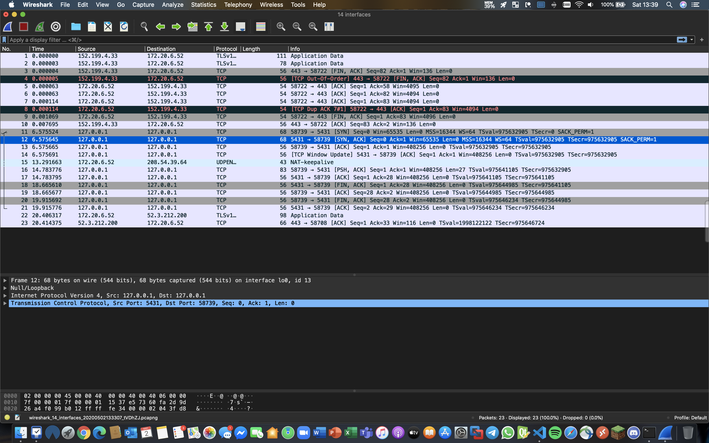
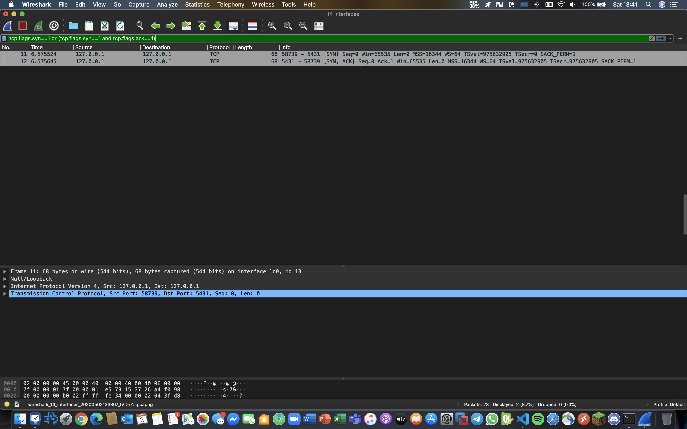
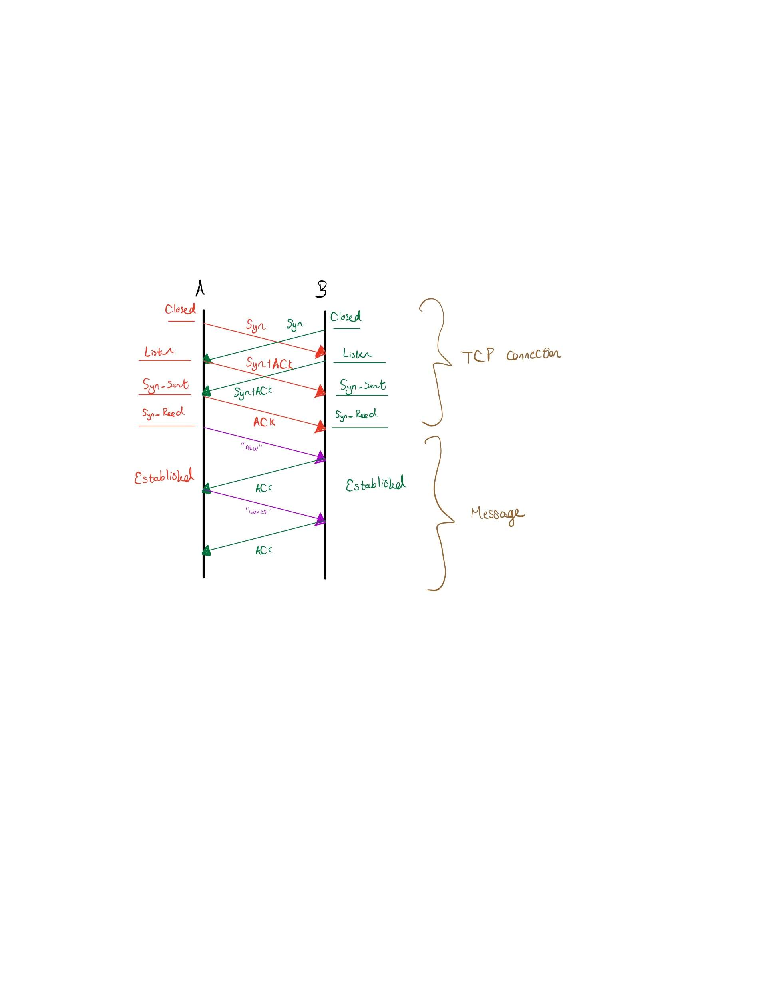

# CS 4375 - Operating Systems

## Homework 9

Listed below are the responses to the questions.

### Questions

**1. Using the TCP simplex-talk program provided in Chapter 12 of Dordal’s _Introduction to Computer Networks_, and using Wireshark, capture the sequence for opening, transmission through, and closing a connection. Highlight the handshaking in the Wireshark trace.**

Below is the output Wireshark trace using the simplex-talk program, ```stalks.java``` ```stalkc.java```. No modification to the code was needed. If the images are not displaying properly, the screencaptures are located in the ```/homework-9-GigaMatt/src/img/wireshark-output-general.PNG``` and ```/homework-9-GigaMatt/src/img/wireshark-output-specific.PNG``` subdirectory of this repository.</br>

Based on the output shown below, it appears that the handshaking occurs at lines 11 and 12. We know this because with the TCP handshake, we are looking for the ```SYN```,```SYN, ACK```, which refers to the TCP handshake. We see two of these segments, which occur at line 11 and 12. By applying the following filter ```tcp.flags.syn==1 or (tcp.flags.syn==1 and tcp.flags.ack==1)``` into Wireshark, we see that lines 11 and 12 are highlighted. This indicates that this is where the handshake occurs.

<!--
```
No.	Time	Source	Destination	Protocol	Length	Info
1	0.000000	152.199.4.33	172.20.6.52	TLSv1.2	111	Application Data
2	0.000003	152.199.4.33	172.20.6.52	TLSv1.2	78	Application Data
3	0.000004	152.199.4.33	172.20.6.52	TCP	56	443 → 58722 [FIN, ACK] Seq=82 Ack=1 Win=136 Len=0
4	0.000005	152.199.4.33	172.20.6.52	TCP	56	[TCP Out-Of-Order] 443 → 58722 [FIN, ACK] Seq=82 Ack=1 Win=136 Len=0
5	0.000063	172.20.6.52	152.199.4.33	TCP	54	58722 → 443 [ACK] Seq=1 Ack=58 Win=4095 Len=0
6	0.000063	172.20.6.52	152.199.4.33	TCP	54	58722 → 443 [ACK] Seq=1 Ack=82 Win=4094 Len=0
7	0.000114	172.20.6.52	152.199.4.33	TCP	54	58722 → 443 [ACK] Seq=1 Ack=83 Win=4094 Len=0
8	0.000114	172.20.6.52	152.199.4.33	TCP	54	[TCP Dup ACK 7#1] 58722 → 443 [ACK] Seq=1 Ack=83 Win=4094 Len=0
9	0.001069	172.20.6.52	152.199.4.33	TCP	54	58722 → 443 [FIN, ACK] Seq=1 Ack=83 Win=4096 Len=0
10	0.007695	152.199.4.33	172.20.6.52	TCP	56	443 → 58722 [ACK] Seq=83 Ack=2 Win=136 Len=0
11	6.575524	127.0.0.1	127.0.0.1	TCP	68	58739 → 5431 [SYN] Seq=0 Win=65535 Len=0 MSS=16344 WS=64 TSval=975632905 TSecr=0 SACK_PERM=1
12	6.575645	127.0.0.1	127.0.0.1	TCP	68	5431 → 58739 [SYN, ACK] Seq=0 Ack=1 Win=65535 Len=0 MSS=16344 WS=64 TSval=975632905 TSecr=975632905 SACK_PERM=1
13	6.575665	127.0.0.1	127.0.0.1	TCP	56	58739 → 5431 [ACK] Seq=1 Ack=1 Win=408256 Len=0 TSval=975632905 TSecr=975632905
14	6.575691	127.0.0.1	127.0.0.1	TCP	56	[TCP Window Update] 5431 → 58739 [ACK] Seq=1 Ack=1 Win=408256 Len=0 TSval=975632905 TSecr=975632905
15	13.291663	172.20.6.52	208.54.39.64	UDPENCAP	43	NAT-keepalive
16	14.783776	127.0.0.1	127.0.0.1	TCP	83	58739 → 5431 [PSH, ACK] Seq=1 Ack=1 Win=408256 Len=27 TSval=975641105 TSecr=975632905
17	14.783795	127.0.0.1	127.0.0.1	TCP	56	5431 → 58739 [ACK] Seq=1 Ack=28 Win=408256 Len=0 TSval=975641105 TSecr=975641105
18	18.665610	127.0.0.1	127.0.0.1	TCP	56	5431 → 58739 [FIN, ACK] Seq=1 Ack=28 Win=408256 Len=0 TSval=975644985 TSecr=975641105
19	18.665677	127.0.0.1	127.0.0.1	TCP	56	58739 → 5431 [ACK] Seq=28 Ack=2 Win=408256 Len=0 TSval=975644985 TSecr=975644985
20	19.915692	127.0.0.1	127.0.0.1	TCP	56	58739 → 5431 [FIN, ACK] Seq=28 Ack=2 Win=408256 Len=0 TSval=975646234 TSecr=975644985
21	19.915776	127.0.0.1	127.0.0.1	TCP	56	5431 → 58739 [ACK] Seq=2 Ack=29 Win=408256 Len=0 TSval=975646234 TSecr=975646234
22	20.406317	172.20.6.52	52.3.212.200	TLSv1.2	98	Application Data
23	20.414375	52.3.212.200	172.20.6.52	TCP	66	443 → 58708 [ACK] Seq=1 Ack=33 Win=116 Len=0 TSval=1998122122 TSecr=975646724
```
-->

</br></br>


**2. Chapter 12, Question 2.0 in Dordal’s _Introduction to Computer Networks_:</br></br>Trace the states visited if nodes A and B attempt to create a TCP connection by simultaneously sending each other SYN packets, that then cross in the network. Draw the ladder diagram, and label the states on each side. Hint: there should be two pairs of crossing packets. A SYN+ACK counts, in the state diagram, as an ACK.**

Below is the drawing I did of the ladder diagram on my iPad. If the image is not displaying properly, the drawing is located in the ```/homework-9-GigaMatt/src/img/12-2.JPG``` subdirectory of this repository. Apologies for the extra whitespace in the image.

The two pairs of crossing packets occur during the ```SYN``` and ```SYN+ACK``` portions of the TCP Connection. In this example, there are two pieces of data being sent from (A) to (B), which is the title of my favorite book of 2020: _New Waves: A Novel_ by Kevin Nguyen. In the example that is drawn, the distinction between the establishment of the TCP connection and the message being sent is marked in brown. The inclusion of the message is meant to demonstrate where the establishment of the TCP connection ends, and where the transfer of data packets begin. There is, however, an omission from the ladder that would normally be present: Closing the connection. This was intentionally left out because the question asks for the ladder diagram as it pertains to creating a TCP connection by simultaneously sending each other SYN packets.



**3. Chapter 12, Question 12.0 in Dordal’s _Introduction to Computer Networks_:</br></br>Suppose A connects to B via TCP, and sends the message “Attack at noon”, followed by FIN. Upon receiving this, B is sure it has received the entire message.</br></br>(a). What can A be sure of upon receiving B’s own FIN+ACK?</br>(b). What can B be sure of upon receiving A’s final ACK?</br>(c). What is A not absolutely sure of after sending its final ACK?**

 - **A.** Upon receiving (B)’s own FIN+ACK, (A) can be sure that it can send an acknowledgement that it has finished sending the last of the data packets, (FIN). After this occurs, (B) the sends to (A) an acknowledgement of _FIN_. Similarly, (B) will send its own FIN to (A) when it longer has data to send.

 - **B.** Upon receiving (A)’s final ACK, (B) can be sure that it the last packet in the communication exchange between (A) and (B). This tells (B) that the connection between the two endpoints will cease after (B) receives the last of the data from (A).

 - **C.** After sending its final ACK, the connection between (A) & (B) has been closed. A is not absolutely sure that is has recieved the entirety of the data. This means that if/when (B) retransmits its _FIN_, (B) will not receive an _ACK_ if (A) has ceased the connection. Ideally, (A) should not terminate the conenction until it is sure (B) has received the final _ACK_.